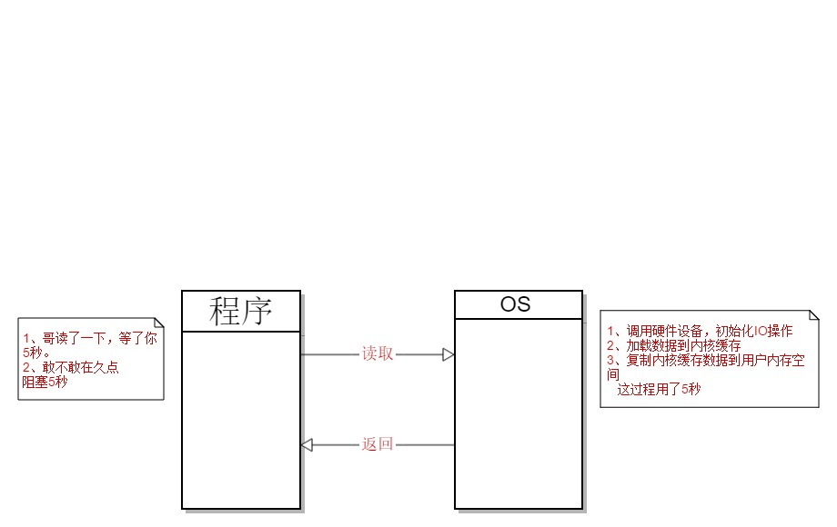
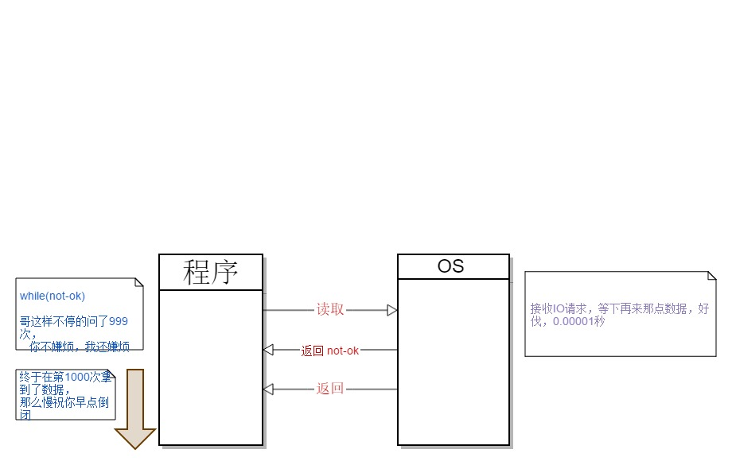

<h1>Java IO</h1>

<h4>这里讨论三种网络IO</h4>

  <li>1、BIO 同步阻塞IO<li>  
         
&nbsp;&nbsp;&nbsp;&nbsp;&nbsp;服务器实现模式为一个连接一个线程，即客户端有连接请求时服务器端就需要启动一个线程进行处理，如果这个连接不做任何事情，会造成不必要的线程开销，当然可以通过线程池机制改善。

         &nbsp;&nbsp;&nbsp;&nbsp;&nbsp;举个例子：小明去买包子，然后包子没熟，就一直等到包子熟了才买到离开。
      

   <li> 2、NIO 同步非阻塞IO</li>
  
  
&nbsp;&nbsp;&nbsp;&nbsp;&nbsp;服务器实现模式为一个请求一个线程，即客户端发送的连接请求都会注册到多路复用器上，多路复用器轮询到连接有I/O请求时才启动一个线程进行处理。

  
  
&nbsp;&nbsp;&nbsp;&nbsp;&nbsp;举个例子：小明去买包子，包子没熟，小明就低头玩手机，时不时回来问下包子好了没，直到老板说包子好了，小明又转回去买到包子了。

  

  
  <li>3、AIO  异步非阻塞IO</li>
  
  
&nbsp;&nbsp;&nbsp;&nbsp;&nbsp;服务器实现模式为一个有效请求一个线程，客户端的I/O请求都是由OS先完成了再通知服务器应用去启动线程进行处理

  
  
&nbsp;&nbsp;&nbsp;&nbsp;&nbsp;举个例子：小明去买包子，但是包子还没做好，然后小明留下地址走了，回去做其他事情了，包子做好了，老板叫哒哒外送把包子送到小明留的地址，小明终于吃到了包子。
  

    
